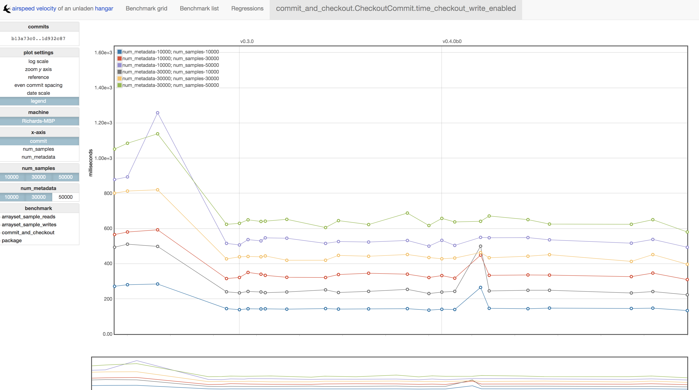
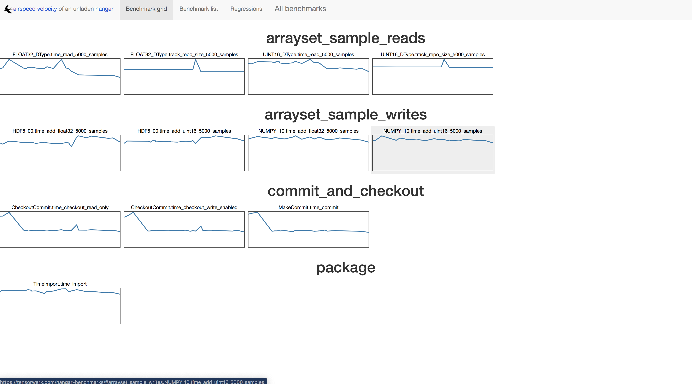

Hangar Performance Benchmarking Suite
=====================================

A set of benchmarking tools are included in order to track the performance of
common hangar operations over the course of time. The benchmark suite is run
via the phenomenal `Airspeed Velocity (ASV) <https://asv.readthedocs.io/>`_
project.

Benchmarks can be viewed at the following web link, or by examining the raw
data files in the separate benchmark results repo.

-  `Benchmark Web View <https://tensorwerk.com/hangar-benchmarks>`_
-  `Benchmark Results Repo <https://github.com/tensorwerk/hangar-benchmarks>`_

Purpose
*******

In addition to providing historical metrics and insight into application
performance over many releases of Hangar, *the benchmark suite is used as a
canary to identify potentially problematic pull requests.* All PRs to the
Hangar repository are automatically benchmarked by our CI system to compare the
performance of proposed changes to that of the current ``master`` branch.

*The results of this canary are explicitly NOT to be used as the
"be-all-end-all" decider of whether a PR is suitable to be merged or not.*

Instead, it is meant to serve the following purposes:

1. **Help contributors understand the consequences of some set of changes on the
   greater system early in the PR process.** Simple code is best; if there's no
   obvious performance degradation or significant improvement to be had, then
   there's no need (or really rationale) for using more complex algorithms or
   data structures. It's more work for the author, project maintainers, and
   long term health of the codebase.

2. **Not everything can be caught by the capabilities of a traditional test
   suite.** Hangar is fairly flat/modular in structure, but there are certain
   hotspots in the codebase where a simple change could drastically degrade
   performance. It's not always obvious where these hotspots are, and even a
   change which is functionally identical (introducing no issues/bugs to the
   end user) can unknowingly cross a line and introduce some large regression
   completely unnoticed to the authors/reviewers.

3. Sometimes tradeoffs need to be made when introducing something new to a
   system. Whether this be due to fundamental CS problems (space vs. time) or
   simple matters of practicality vs. purity, it's always easier to act in
   environments where relevant information is available before a decision is
   made. **Identifying and quantifying tradeoffs/regressions/benefits during
   development is the only way we can make informed decisions.** The only times
   to be OK with some regression is when knowing about it in advance, it might
   be the right choice at the time, but if we don't measure we will never know.

Important Notes on Using/Modifying the Benchmark Suite
******************************************************

1. **Do not commit any of the benchmark results, environment files, or generated
   visualizations to the repository**. We store benchmark results in a `separate
   repository <https://github.com/tensorwerk/hangar-benchmarks>`_ so to not
   clutter the main repo with un-necessary data. The default directories these are
   generated in are excluded in our ``.gitignore`` config, so baring some unusual
   git usage patterns, this should not be a day-to-day concern.

2. Proposed changes to the benchmark suite should be made to the code in this
   repository first. The benchmark results repository mirror will be
   synchronized upon approval/merge of changes to the main Hangar repo.

Introduction to Running Benchmarks
**********************************

As ASV sets up and manages it's own virtual environments and source
installations, benchmark execution is not run via ``tox``. While a brief
tutorial is included below, please refer to the `ASV Docs
<https://asv.readthedocs.io/>`_ for detailed information on how to both run,
understand, and write ASV benchmarks.

First Time Setup
----------------

1. Ensure that ``virtualenv``, ``setuptools``, ``pip`` are updated to the
   latest version.

2. Install ASV ``$ pip install asv``.

3. Open a terminal and navigate to the ``hangar-py/asv-bench`` directory.

4. Run ``$ asv machine`` to record details of your machine, it is OK to
   just use the defaults.

Running Benchmarks
------------------

Refer to the `using ASV
<https://asv.readthedocs.io/en/stable/using.html#running-benchmarks>`_ page for
a full tutorial, paying close attention to the `asv run
<https://asv.readthedocs.io/en/stable/commands.html#asv-run>`_ command.
Generally ``asv run`` requires a range of commits to benchmark across
(specified via either branch name, tags, or commit digests).

To benchmark every commit between the current master ``HEAD`` and ``v0.3.0``,
you would execute::

    $ asv run v0.2.0..master

However, this may result in a larger workload then you are willing to wait
around for. To limit the number of commits, you can specify the ``--steps=N``
option to only benchmark ``N`` commits at most between ``HEAD`` and ``v0.3.0``.

The most useful tool during development is the `asv continuous
<https://asv.readthedocs.io/en/stable/commands.html#asv-continuous>`_ command.
using the following syntax will benchmark any changes in a local development
branch against the base ``master`` commit::

    $ asv continuous origin/master HEAD

Running `asv compare
<https://asv.readthedocs.io/en/stable/commands.html#asv-compare>`_ will
generate a quick summary of any performance differences::

    $ asv compare origin/master HEAD

Visualizing Results
-------------------

After generating benchmark data for a number of commits through history, the
results can be reviewed in (an automatically generated) local web interface by
running the following commands::

    $ asv publish
    $ asv preview

Navigating to ``http://127.0.0.1:8080/`` will pull up an interactive webpage
where the full set of benchmark graphs/explorations utilities can be viewed.
This will look something like the image below.

