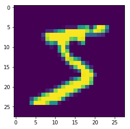

*******************************************
Creating A Repository And Working With Data
*******************************************

This tutorial will review the first steps of working with a hangar
repository.

To fit with the beginner’s theme, we will use the MNIST dataset. Later
examples will show off how to work with much more complex data.

.. code:: python

   >>> from hangar import Repository
   >>> import numpy as np
   >>> import pickle
   >>> import gzip
   >>> import matplotlib.pyplot as plt
   >>> from tqdm import tqdm

Creating & Interacting with a Hangar Repository
===============================================

Hangar is designed to “just make sense” in every operation you have to perform.
As such, there is a single interface which all interaction begins with: the
``Repository`` object.

Weather a hangar repository exists at the path you specify or not, just tell
hangar where it should live!

Initializing a repository
-------------------------

The first time you want to work with a new repository, the ``init()`` method
must be called. This is where you provide hangar with your name and email
address (to be used in the commit log), as well as implicitly confirming that
you do want to create the underlying data files hangar uses on disk.

.. code:: python

   >>> repo = Repository(path='/Users/rick/projects/tensorwerk/hangar-dev-repo/')

   # First time a repository is accessed only!
   # Note: if you feed a path to the `Repository` which does not contain a pre-initialized hangar repo,
   # when the Repository object is initialized it will let you know that you need to run `init()`

   >>> repo.init(user_name='Rick Izzo', user_email='foo@email.com')
   directory initialized at: /Users/rick/projects/tensorwerk/hangar-dev-repo/__hangar

Checking out the repo for writing
=================================

A repository can be checked out in two modes:

1) write-enabled: applies all operations to the staging area’s current
   state. Only one write-enabled checkout can be active at a different time,
   must be closed upon last use, or manual intervention will be needed to remove
   the writer lock.

2) read-only: checkout a commit or branch to view repository state as it
   existed at that point in time.

.. code:: python

   >>> co = repo.checkout(write=True)

Lots of useful information is in the ipython ``__repr__``
---------------------------------------------------------

If you're ever in doubt about what the state of the object your working
on is, just call it's reps, and the most relevant information will be
sent to your screen!

.. code:: python

   >>> co
   Hangar WriterCheckout
       Writer       : True
       Base Branch  : master

A checkout allows access to ``datasets`` and ``metadata``
=========================================================

The `dataset` and `metadata` attributes of a checkout provide
the interface to working with all of the data on disk!

.. code:: python

   >>> co.datasets
   Hangar Datasets
       Writeable: True
       Dataset Names:
           -                # No datasets added yet!

   >>> co.metadata
   Hangar Metadata
       Number of Keys : 0
       Access Mode    : a

Before data can be added to a repository, a dataset must be initialized.
------------------------------------------------------------------------

We're going to first load up a the MNIST pickled dataset so it can be added to
the repo!

.. code:: python

   # Load the dataset
   >>> with gzip.open('/Users/rick/projects/tensorwerk/hangar-dev-data/mnist.pkl.gz', 'rb') as f:
   ...     train_set, valid_set, test_set = pickle.load(f, encoding='bytes')

   >>> def rescale(array):
   ...     array = array * 256
   ...     rounded = np.round(array)
   ...     return rounded.astype(np.uint8())

   >>> sample_trimg = rescale(train_set[0][0])
   >>> sample_trlabel = np.array([train_set[1][0]])
   >>> trimgs = rescale(train_set[0])
   >>> trlabels = train_set[1]

A Dataset is a named grouping of data samples where each sample shares a number
of similar attributes and array properties. See the docstrings in
`co.datasets.init_dataset`:

.. automethod:: hangar.dataset.Datasets.init_dataset
   :noindex:

Let's try it out here:

.. code:: python

   >>> co.datasets.init_dataset(name='mnist_training_images', prototype=trimgs[0])
   Dataset prototype shape: (784,), dtype: uint8
   Hangar DatasetDataWriter
       Dataset Name     : mnist_training_images
       Schema UUID      : d72247d253df11e992758c859047adef
       Schema Hash      : RM4DefFsjRs=
       Variable Shape   : False
       (max) Shape      : (784,)
       Datatype         : <class 'numpy.uint8'>
       Named Samples    : True
       Access Mode      : a
       Num Samples      : 0

Interaction
===========

When a dataset is initialized, a dataset accessor object will be returned,
however, depending on your use case, this may or may not be the most convenient
way to access a dataset.

In general, we have implemented a full ``dict`` mapping interface on top of all
object. To access the ``'mnist_training_images'`` dataset you can just use a
dict style access like the following (note: if operating in ipython/jupyter, the
dataset keys will autocomplete for you).

.. code:: python

   >>> co.datasets['mnist_training_images']
   Hangar DatasetDataWriter
       Dataset Name     : mnist_training_images
       Schema UUID      : d72247d253df11e992758c859047adef
       Schema Hash      : RM4DefFsjRs=
       Variable Shape   : False
       (max) Shape      : (784,)
       Datatype         : <class 'numpy.uint8'>
       Named Samples    : True
       Access Mode      : a
       Num Samples      : 0

.. code:: python

   >>> train_dset = co.datasets['mnist_training_images']

the full dictionary style mapping interface is implemented

Adding Data
-----------

To add data to a named dataset, we can use dict-style setting, or the
``.add`` method.

.. code:: python

   >>> train_dset['0'] = trimgs[0]
   >>> train_dset.add(data=trimgs[1], name='1')
   >>> train_dset['51'] = trimgs[51]

How many samples are in the dataset?
------------------------------------

.. code:: python

   >>> len(train_dset)
   2

containment testing
-------------------

.. code:: python

   >>> 'hi' in train_dset
   False
   >>> '0' in train_dset
   True

Dictionary Style Retrieval for known keys
-----------------------------------------

.. code:: python

   >>> out = train_dset['0']
   >>> plt.imshow(out.reshape(28, 28))

.. code:: python

   >>> train_dset
   Hangar DatasetDataWriter
       Dataset Name     : mnist_training_images
       Schema UUID      : d72247d253df11e992758c859047adef
       Schema Hash      : RM4DefFsjRs=
       Variable Shape   : False
       (max) Shape      : (784,)
       Datatype         : <class 'numpy.uint8'>
       Named Samples    : True
       Access Mode      : a
       Num Samples      : 2

Dict style iteration supported out of the box
---------------------------------------------

.. code:: python

   >>> for k in train_dset:
   ...     # equivalent method: `for k in train_dset.keys():`
   ...     print(k)

    out = []
   >>> for v in train_dset.values():
   ...     out.append(v)

   >>> myDict = {}
   >>> for k, v in train_dset.items():
   ...     myDict[k] = v

Performance
===========

Once you’ve completed an interactive exploration, be sure to use the context
manager form of the ``.add`` and ``.get`` methods!

In order to make sure that all your data is always safe in Hangar, the backend
diligently ensures that all contexts (operations which can somehow interact
with the record structures) are opened and closed appropriately. When you use the
context manager form of a dataset object, we can offload a significant amount of
work to the python runtime, and dramatically increase read and write speeds.

Most datasets we’ve tested see an increased throughput differential of 250% -
500% for writes and 300% - 600% for reads when comparing using the context
manager form vs the naked form!

.. code:: pycon

   # ------------------ Context Manager Form ----------------------

   >>> dset_trimgs = co.datasets.init_dataset(name='train_images', prototype=sample_trimg)
   >>> dset_trlabels = co.datasets.init_dataset(name='train_labels', prototype=sample_trlabel)

   >>> pbar = tqdm(total=trimgs.shape[0]*2)  # one record for each dataset
   >>> with dset_trimgs, dset_trlabels:
   ...     for idx, img in enumerate(trimgs):
   ...         if (idx % 500 == 0):
   ...             pbar.update(1000)
   ...         dset_trimgs.add(data=img, name=str(idx))
   ...         dset_trlabels.add(data=np.array([trlabels[idx]]), name=str(idx))
   >>> pbar.close()

   100%|██████████| 100000/100000 [00:24<00:00, 3962.72it/s]

   # Completed in 24 seconds to add 100,000 records of MNIST to the repository.

   # ----------------- Non-Context Manager Form ----------------------

   >>> pbar = tqdm(total=trimgs.shape[0]*2)
   >>> for idx, img in enumerate(trimgs):
   ...     if (idx % 500 == 0):
   ...         pbar.update(1000)
   ...     dset_trimgs.add(data=img, name=str(idx))
   ...     dset_trlabels.add(data=np.array([trlabels[idx]]), name=str(idx))
   >>> pbar.close()

   100%|██████████| 100000/100000 [02:57<00:00, 574.59it/s]

   # Completed in ~3 minutes to add the same 100,000 records to the repository

Clearly, the context manager form is far and away superior, however we fell that
for the purposes of interactive use that the "Naked" form is valubal to the
average user!

Committing Changes
==================

Once you have made a set of changes you wan’t to commit, just simply
call the ``commit()`` method (and pass in a message)!

.. automethod:: hangar.checkout.WriterCheckout.commit
   :noindex:

.. code:: python

    >>> co.commit('hello world, this is my first hangar commit')
    'ce7dfe7c548aec58'

The returned value (`'ce7dfe7c548aec58'`) is the commit hash of this commit. It
may be useful to assign this to a variable and follow this up by creating a
branch from this commit! (Branching to be covered in the next round of
tutorials)

Don’t Forget to Close the Write-Enabled Checkout
------------------------------------------------

We mentioned in `Checking out the repo for writing`_ that when a `write-enabled`
checkout is created, it places a lock on writers until it is closed. If for
whatever reason the program terminates without closing the write-enabled
checkout, this lock will persist (forever technically, but realistically until
it is manually freed).

.. automethod:: hangar.checkout.WriterCheckout.close
   :noindex:

Luckily, preventing this issue from occurring is as simple as calling `close()`!

.. code:: python

    # Just call...
    >>> co.close()
    True

But, if you did forget...
-------------------------

you will receive a ``PermissionError`` next time you open a checkout!

::

   PermissionError: Cannot acquire the writer lock. Only one instance of
   a writer checkout can be active at a time. If the last checkout of this
   repository did not properly close, or a crash occurred, the lock must be
   manually freed before another writer can be instantiated.

It’s an easy fix! JUST BE CAREFUL!

.. code:: python

    >>> repo.force_release_writer_lock()
    /Users/rick/projects/tensorwerk/hangar-py/src/hangar/records/heads.py:141:
     UserWarning: USER WARNING: Writer lock force released. warnings.warn(
     'USER WARNING: Writer lock force released.')

    True

This is a dangerous operation, and is one of the only ways where a user can put
data in their repository at risk! If another python process is still holding the
lock, do NOT force the release. Kill the process (that's totally fine to do at
any time, then force the lock release).

When in doubt, refer to the docstrings:

.. automethod:: hangar.repository.Repository.force_release_writer_lock
   :noindex:

Inspecting State
================

After your first commit, the summary and log methods will begin to work,
and you can either print the stream to the console (as shown below), or
you can dig deep into the internal of how hangar thinks about your data!
(To be covered in an advanced tutorial later on).

The point is, regardless of your level of interaction with a live hangar
repository, all level of state is accessible from the top, and in
general has been built to be the only way to directly access it!

.. code:: pycon

    >>> repo.summary()
    Summary of Contents Contained in Data Repository

    ==================
    | Repository Info
    |-----------------
    |  Directory: /Users/rick/projects/tensorwerk/hangar-dev-repo/__hangar
    |  Disk Usage: 46.13 MB

    ===================
    | Commit Details
    -------------------
    |  Commit: ce7dfe7c548aec58
    |  Created: Sun Mar 31 18:29:48 2019
    |  By: Rick Izzo
    |  Email: foo@email.com
    |  Message: 'hello world, this is my first hangar commit'

    ==================
    | DataSets
    |-----------------
    |  Number of Named Datasets: 2
    |
    |  * Dataset Name: train_images
    |    Num Arrays: 50000
    |    Details:
    |    - schema_uuid: daab93a653e211e989a98c859047adef
    |    - schema_hash: RM4DefFsjRs=
    |    - schema_dtype: 2
    |    - schema_is_var: False
    |    - schema_max_shape: [784]
    |    - schema_is_named: True
    |
    |  * Dataset Name: train_labels
    |    Num Arrays: 50000
    |    Details:
    |    - schema_uuid: daf2623653e211e9acd18c859047adef
    |    - schema_hash: ncbHqE6Xldg=
    |    - schema_dtype: 7
    |    - schema_is_var: False
    |    - schema_max_shape: [1]
    |    - schema_is_named: True

    ==================
    | Metadata:
    |-----------------
    |  Number of Keys: 0

And then to view the log in graph format:

.. code:: python

    >>> repo.log()
    * ce7dfe7c548aec58 (31Mar2019 18:29:48) (Rick Izzo): hello world, first commit

(don't worry, this will fill up in later tutorials!)
