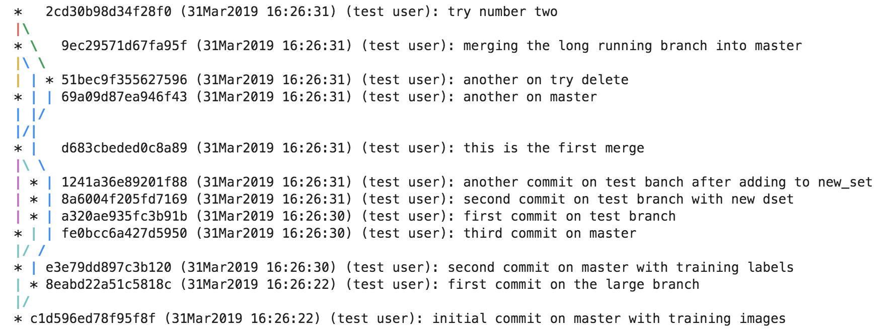

.. _ref-hangar-under-the-hood:

=====================
Hangar Under The Hood
=====================

.. warning::

  The usage info displayed in the ``latest`` build of the project
  documentation do not reflect recent changes to the API and internal
  structure of the project. They should not be relied on at the current
  moment; they will be updated over the next weeks, and will be in line before
  the next release.

At its core, Hangar is a content addressable data store whose design
requirements were inspired by the Git version control system.

Things In Life Change, Your Data Shouldn't
==========================================

When designing a high performance data version control system, achieving
performance goals while ensuring consistency is incredibly difficult. Memory is
fast, disk is slow; not much we can do about it. But since Hangar should
deal with any numeric data in an array of any size (with an enforced limit of
31 dimensions in a sample...) we have to find ways to work *with* the disk,
not against it.

Upon coming to terms with this face, we are actually presented with a problem
once we realize that we live in the real world, and real world is ugly.
Computers crash, processes get killed, and people do * *interesting* * things.
Because of this, It is a foundational design principle for us to **guarantee
that once Hangar says data has been successfully added to the repository, it is
actually persisted.** This essentially means that any process which interacts
with data records on disk must be stateless. If (for example) we were to keep a
record of all data added to the staging area in an in-memory list, and the
process gets killed, we may have just lost references to all of the array data,
and may not even be sure that the arrays were flushed to disk properly. These
situations are a NO-GO from the start, and will always remain so.

So, we come to the first design choice: **read and write actions are atomic**.
Once data is added to a Hangar repository, the numeric array along with the
necessary book-keeping records will *always* occur transactionally, ensuring
that when something unexpected happens, the data and records are committed to
disk.

.. note::

  The atomicity of interactions is completely hidden from a normal user; they
  shouldn't have to care about this or even know this exists. However, this
  is also why using the context-manager style column interaction scheme can
  result in ~2x times speedup on writes/reads. We can just pass on most of the
  work to the Python ``contextlib`` package instead of having to begin and
  commit/abort (depending on interaction mode) transactions with every call to
  an `add` or `get` method.

Data Is Large, We Don't Waste Space
===================================

From the very beginning we knew that while it would be easy to just store all
data in every commit as independent arrays on disk, such a naive implementation
would just absolutely eat up disk space for any repository with a non-trivial
history. Hangar commits should be fast and use minimal disk space, duplicating
data just doesn't make sense for such a system. And so we decided on
implementing a content addressable data store backend.

When a user requests to add data to a Hangar repository, one of the first
operations which occur is to generate a hash of the array contents. If the hash
does not match a piece of data already placed in the Hangar repository, the
data is sent to the appropriate storage backend methods. On success, the
backend sends back some arbitrary specification which can be used to retrieve
that same piece of data from that particular backend. The record backend then
stores a key/value pair of (`hash`, `backend_specification`).

.. note::

  The record backend stores hash information in a separate location from the
  commit references (which associate a `(columnname, sample name/id)` to a
  `sample_hash`). This let's us separate the historical repository
  information from a particular computer's location of a data piece. All we need in
  the public history is to know that some data with a particular hash is
  associated with a commit. No one but the system which actually needs to access
  the data needs to know where it can be found.

On the other hand, if a data sample is added to a repository which already has
a record of some hash, we don't even involve the storage backend. All we need
to do is just record that a new sample in a column was added with that hash.
It makes no sense to write the same data twice.

This method can actually result in massive space savings for some common use
cases. For the MNIST column, the training label data is typically a 1D-array
of size 50,000. Because there are only 10 labels, we only need to store 10 ints
on disk, and just keep references to the rest.

The Basics of Collaboration: Branching and Merging
==================================================

Up to this point, we haven't actually discussed much about how data and records
are treated on disk. We'll leave an entire walkthrough of the backend record
structure for another tutorial, but let's introduce the basics here, and see
how we enable the types of branching and merging operations you might be used
to with source code (at largely the same speed!).

Here's a few core principles to keep in mind:

Numbers == Numbers
------------------

Hangar has no concept of what a piece of data is outside of a string of bytes /
numerical array, and most importantly, *hangar does not care*; Hangar is a
tool, and we leave it up to you to know what your data actually means)!

At the end of the day when the data is placed into *some* collection on disk,
the storage backend we use won't care either. In fact, this is the entire
reason why Hangar can do what it can; we don't attempt to treat data as
anything other then a series of bytes on disk!

The fact that *Hangar does not care about what your data represents* is a
fundamental underpinning of how the system works under the hood. It is the
*designed and intended behavior* of Hangar to dump arrays to disk in what would
seem like completely arbitrary buffers/locations to an outside observer. And
for the most part, they would be essentially correct in their observation that
data samples on disk are in strange locations.

While there is almost no organization or hierarchy for the actual data samples
when they are stored on disk, that is not to say that they are stored without
care! We may not care about global trends, but we do care a great deal about
the byte order/layout, sequentiality, chunking/compression and validations
operations which are applied across the bytes which make up a data sample.

In other words, we optimize for utility and performance on the backend, not so
that a human can understand the file format without a computer! After the array
has been saved to disk, all we care about is that bookkeeper can record some
unique information about where some piece of content is, and how we can read
it. **None of that information is stored alongside the data itself - Remember:
numbers are just numbers - they don't have any concept of what they are**.

Records != Numbers
------------------

*The form numerical data takes once dumped on disk is completely irrelevant to
the specifications of records in the repository history.*

Now, let's unpack this for a bit. We know from `Numbers == Numbers`_ that data
is saved to disk in some arbitrary locations with some arbitrary backend. We
also know from `Data Is Large, We Don't Waste Space`_ that the permanent
repository information only contains a record which links a sample name to a
hash. We also assert that there is also a mapping of hash to storage backend
specification kept somewhere (doesn't matter what that mapping is for the
moment). With those 3 pieces of information, it's obvious that once data is
placed in the repository, we don't actually need to interact with it to
understand the accounting of what was added when!

In order to make a commit, we just pack up all the records which existed in the
staging area, create a hash of the records (including the hash of any parent
commits), and then store the commit hash mapping alongside details such as the
commit user/email and commit message, and a compressed version of the full
commit records as they existed at that point in time.

.. note::

  That last point "storing a compressed version of the full commit records", is
  semi inefficient, and will be changed in the future so that unchanged records
  are note duplicated across commits.

An example is given below of the keys -> values mapping which stores each of
the staged records, and which are packed up / compressed on commit (and
subsequently unpacked on checkout!).

::

    Num asets                      'a.'               -> '2'
    ---------------------------------------------------------------------------
    Name of aset -> num samples || 'a.train_images'   -> '10'
    Name of data -> hash        || 'a.train_images.0' -> BAR_HASH_1'
    Name of data -> hash        || 'a.train_images.1' -> BAR_HASH_2'
    Name of data -> hash        || 'a.train_images.2' -> BAR_HASH_3'
    Name of data -> hash        || 'a.train_images.3' -> BAR_HASH_4'
    Name of data -> hash        || 'a.train_images.4' -> BAR_HASH_5'
    Name of data -> hash        || 'a.train_images.5' -> BAR_HASH_6'
    Name of data -> hash        || 'a.train_images.6' -> BAR_HASH_7'
    Name of data -> hash        || 'a.train_images.7' -> BAR_HASH_8'
    Name of data -> hash        || 'a.train_images.8' -> BAR_HASH_9'
    Name of data -> hash        || 'a.train_images.9' -> BAR_HASH_0'
    ---------------------------------------------------------------------------
    Name of aset -> num samples || 'a.train_labels'   -> '10'
    Name of data -> hash        || 'a.train_labels.0' -> BAR_HASH_11'
    Name of data -> hash        || 'a.train_labels.1' -> BAR_HASH_12'
    Name of data -> hash        || 'a.train_labels.2' -> BAR_HASH_13'
    Name of data -> hash        || 'a.train_labels.3' -> BAR_HASH_14'
    Name of data -> hash        || 'a.train_labels.4' -> BAR_HASH_15'
    Name of data -> hash        || 'a.train_labels.5' -> BAR_HASH_16'
    Name of data -> hash        || 'a.train_labels.6' -> BAR_HASH_17'
    Name of data -> hash        || 'a.train_labels.7' -> BAR_HASH_18'
    Name of data -> hash        || 'a.train_labels.8' -> BAR_HASH_19'
    Name of data -> hash        || 'a.train_labels.9' -> BAR_HASH_10'
    ---------------------------------------------------------------------------
    's.train_images'   -> '{"schema_hash": "RM4DefFsjRs=",
                            "schema_dtype": 2,
                            "schema_is_var": false,
                            "schema_max_shape": [784],
                            "schema_is_named": true}'
    's.train_labels'   -> '{"schema_hash":
                            "ncbHqE6Xldg=",
                            "schema_dtype": 7,
                            "schema_is_var": false,
                            "schema_max_shape": [1],
                            "schema_is_named": true}'

History is Relative
-------------------

Though it may be a bit obvious to state, it is of critical importance to
realize that it is only because we store the full contents of the repository
staging area as it existed in the instant just prior to a commit, that the
integrity of full repository history can be verified from a single commit's
contents and expected hash value. More so, any single commit has only a topical
relationship to a commit at any other point in time. It is only our imposition
of a commit's ancestry tree which actualizes any subsequent insights or
interactivity

While the general process of topological ordering: create branch, checkout
branch, commit a few times, and merge, follows the `git` model fairly well at a
conceptual level, there are some important
differences we want to highlight due to their implementation differences:

1) Multiple commits can simultaneously checked out in "read-only" mode on a
   single machine. Checking out a commit for reading does not touch the staging
   area status.
2) Only one process can interact with the a write-enabled checkout at a time.
3) A detached head CANNOT exist for write enabled checkouts. A staging area must
   begin with an identical state to the most recent commit of a/any branch.
4) A staging area which has had changes made in it cannot switch base branch
   without either a commit, hard-reset, or (soon to be developed) stash
   operation.

When a repository is initialized, a record is created which indicates the
staging area's `HEAD` branch. in addition, a branch is created with the name
`master`, and which is the only commit in the entire repository which will have
no parent. The record key/value pairs resemble the following:

::

  'branch.master' -> ''                # No parent commit.
  'head'          -> 'branch.master'   # Staging area head branch

  # Commit Hash  |  Parent Commit
  -------------------------------------

.. warning::

  Much like git, odd things can happen before the `'initial commit'` is made. We
  recommend creating the initial commit as quickly as possible to prevent
  undefined behavior during repository setup. In the future, we may decide to
  create the "initial commit" automatically upon repository initialization.

Once the initial commit is made, a permanent commit record in made which
specifies the records (not shown below) and the parent commit. The branch head
pointer is then updated to point to that commit as it's base.

::

    'branch.master' -> '479b4cfff6219e3d'
    'head'          -> 'branch.master'

    # Commit Hash       |  Parent Commit
    -------------------------------------
    '479b4cfff6219e3d' ->  ''

Branches can be created as cheaply as a single line of text can be written, and
they simply require a "root" commit hash (or a branch name, in which case the
branch's current HEAD commit will be used as the root HEAD). Likewise a branch
can be merged with just a single write operation (once the merge logic has
completed - a process which is explained separately from this section; just
trust that it happens for now).

A more complex example which creates 4 different branches and merges them in a
complicated order can be seen below. Please note that the `` << `` symbol is
used to indicate a merge commit where `X << Y` reads: ``'merging dev branch Y
into master branch X'``.

::

    'branch.large_branch' -> '8eabd22a51c5818c'
    'branch.master'       -> '2cd30b98d34f28f0'
    'branch.test_branch'  -> '1241a36e89201f88'
    'branch.trydelete'    -> '51bec9f355627596'
    'head'                -> 'branch.master'

     # Commit Hash       |  Parent Commit
     -------------------------------------
    '1241a36e89201f88'  -> '8a6004f205fd7169'
    '2cd30b98d34f28f0'  -> '9ec29571d67fa95f << 51bec9f355627596'
    '51bec9f355627596'  -> 'd683cbeded0c8a89'
    '69a09d87ea946f43'  -> 'd683cbeded0c8a89'
    '8a6004f205fd7169'  -> 'a320ae935fc3b91b'
    '8eabd22a51c5818c'  -> 'c1d596ed78f95f8f'
    '9ec29571d67fa95f'  -> '69a09d87ea946f43 << 8eabd22a51c5818c'
    'a320ae935fc3b91b'  -> 'e3e79dd897c3b120'
    'c1d596ed78f95f8f'  -> ''
    'd683cbeded0c8a89'  -> 'fe0bcc6a427d5950 << 1241a36e89201f88'
    'e3e79dd897c3b120'  -> 'c1d596ed78f95f8f'
    'fe0bcc6a427d5950'  -> 'e3e79dd897c3b120'

Because the raw commit hash logs can be quite dense to parse, a graphical
logging utility is included as part of the repository. Running the
``Repository.log()`` method will pretty print a graph representation of the
commit history:

.. code:: python

  >>> from hangar import Repository
  >>> repo = Repository(path='/foo/bar/path/')

  ... # make some commits

  >>> repo.log()

